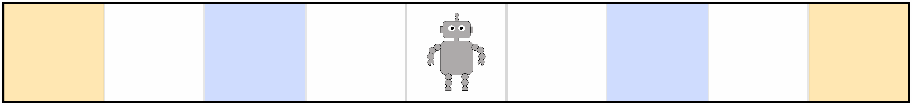
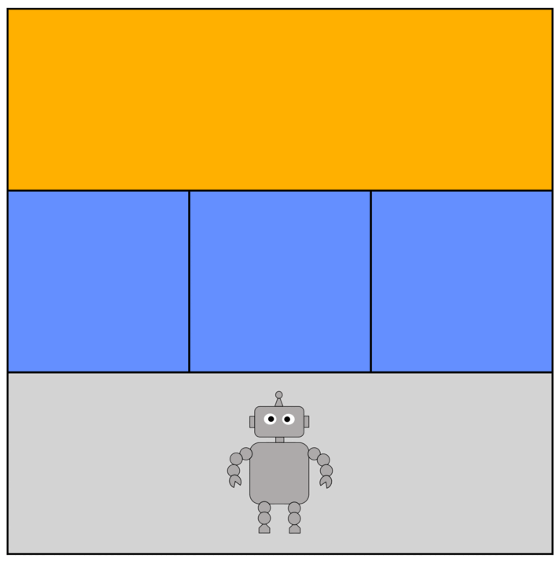

# Flow-Constraints
## Authors and Contributors
Apurva Badithela, Josefine B. Graebener,  Wyatt Ubellacker  

## Description
A module to generate constrained test environments that leverage flow algorithms.

This branch contains code for reproducing the results in "synthesizing Reactive Test Environments for Autonomous Systems: Testing Reach-Avoid specifications using Multi-Commodity Flows" by Apurva Badithela\*, Josefine B. Graebener\*, Wyatt Ubellacker, Eric V. Mazumdar, Aaron D. Ames and Richard M. Murray submitted to ICRA 2023.

## Requirements
Python 3.x 
Packages: see **requirements.txt** and TuLiP  

## Instructions
1. Install the required packages by running 'pip install -r requirements.txt'  
2. Install TuLiP from https://github.com/tulip-control/tulip-control
3. Run corridor_example/simulate.py for a demonstration of the corridor example  
4. Run search_and_rescue_simulation/simulate.py for a demonstration of the 3 door robot navigation example  
5. To produce an animation of the result run animate.py after step 3. or 4. in the corresponding example directory

## Examples
### Corridor Example

### Robot Navigation Example

  

