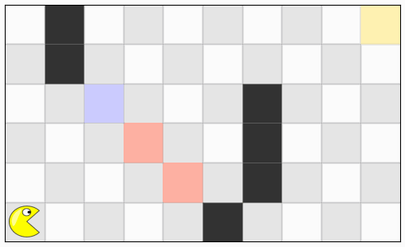
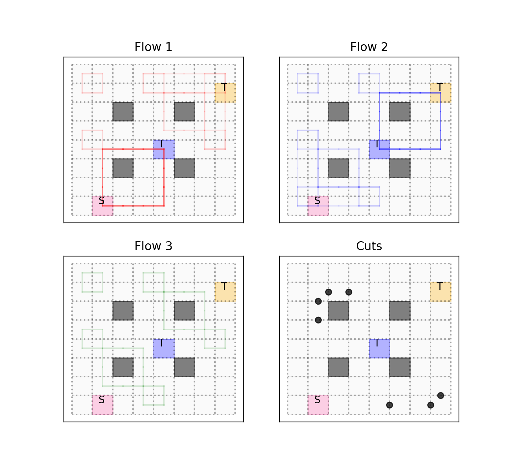

# Flow-Constraints
## Authors and Contributors
Apurva Badithela, Josefine B. Graebener,  Wyatt Ubellacker  

## Description
A module to generate constrained test environments that leverage flow algorithms.

This branch contains code for reproducing the results in "synthesizing Reactive Test Environments for Autonomous Systems: Testing Reach-Avoid specifications using Multi-Commodity Flows" by Apurva Badithela\*, Josefine B. Graebener\*, Wyatt Ubellacker, Eric V. Mazumdar, Aaron D. Ames and Richard M. Murray submitted to ICRA 2023.

## Requirements
Python 3.x 
Packages: see **requirements.txt** and TuLiP  

## Instructions
1. Install the required packages by running 'pip install -r requirements.txt'  
2. Install TuLiP from https://github.com/tulip-control/tulip-control
3. Run corridor_example/simulate.py for a demonstration of the corridor example  
4. Run search_and_rescue_simulation/simulate.py for a demonstration of the 3 door robot navigation example  
5. To produce an animation of the result run animate.py after step 3. or 4. in the corresponding example directory

## Examples
### Corridor Example
This is the running example in the paper, the robot (system under test) starts in the center of the corridor and wants to reach either of the yellow goal cells at either end of the corridor. The tester wants the system to pass through both of the blue cells first, which is encoded in the tester specification. In the resulting test execution the tester places an obstacle to force the robot to pass through both blue cells before it can reach a yellow goal cell.

### Robot Navigation 3 Door Example
This example is inspired by a search and rescue mission, the robot starts on one side of three doors (blue cells) and need to reach the goal state on the other side (yellow cell). The tester wants the robot to try all three doors before it is allowed to pass through to its goal state. In the resulting test execution the tester places obstacles ("locks the doors") such that the robot can only reach its goal state after passing through all three blue cells.

  

### Pacman Maze Example
We also implemented the flow-cut algorithm on simpler grid world examples, such as this maze example. The agent under test (pacman) wants to reach its goal state (yellow), but the tester places obstacles (red) such that every test execution will route pacman though the intermediate state (blue). In this case the obstacles can be placed statically on the gridworld as the system and tester specifications each only contain a single location on the grid.

  

### Road Network
This road network is another example of placing static obstacles using the flow-cut algorithm. The grid world in this case is a road network with two lanes and intersection. The initial position of the car is marked 'S', the intermediate state is 'I' and the goal state is 'T'.
The algorithm fins a set static obstacles to cut the flow around 'I' (labeled Flow 3 - there is no flow from cell S to cell T) but still enable a max flow of 2 for the flow from S to I (Flow 1) and from I to T (Flow 2). Note that this framework does not minimize the number of obstacles.

  

